# Network Configuration with Packet Tracer - Lab 3

Alexander Hoffmann - alexander.hoffmann@edu.ece.fr

### Q2
Changing the hostname of a device is done in the CLI using the following command:
```
Switch(config)# hostname SWX
```
Here, we changed the name of the root bridge switch to SWX. The same idea applies for all other devices.

### Q3
To configure a switch interface:
```
Switch(config)#interface Vlan 1
Switch(config-if)#ip address 192.168.0.2 255.255.255.0
Switch(config-if)#no shutdown
```
In this example, we configured SWX2 but the same principle applies for all the other switches. Now to configure a PC, we just use the graphical interface. Since it has already been done in the first two labs, it is not necessary to go into any deeper into the configuration process.

### Q4
Now that we connected all of the devices and distributed IP addresses, we can try an ping each and everyone of them. To make this job easier, we just ping the broadcast IP address of the domain which is 192.168.0.255 and see who responds.\
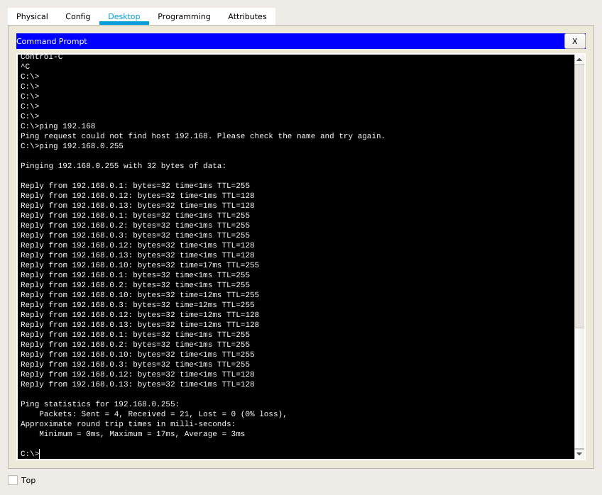\
As can be observed, all of the devices we configured responded to the ICMP echo request successfully.

### Q5
The Root bridge switch is a special bridge at the top of the Spanning Tree. The branches (Ethernet connections) are then branched out from the root switch, connecting to other switches in the Local Area Network (LAN). In this configuration, the root bridge switch is SWX.

### Q6
When an administrator wants a specific switch to become a root bridge, the bridge priority value must be adjusted to ensure that it is lower than the bridge priority values of all the other switches on the network.
To ensure that a switch has the lowest bridge priority value, use the following command:
```
Switch(config)#spanning-tree Vlan 1 root primary
```
Now SWX is set up to be the root bridge. We can verify this by going to the global configuration and using the following command:
```
Switch#show spanning-tree
```
Which yields the folowing result:\
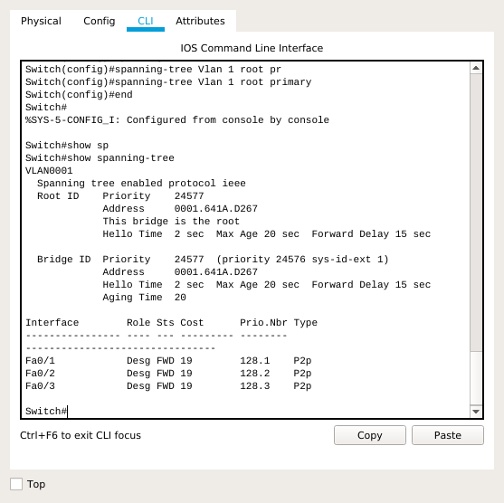

### Q7
SWX:\
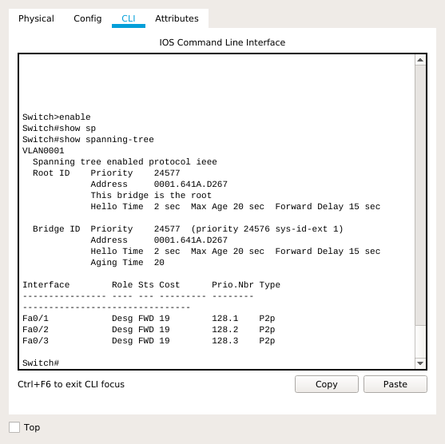

SWX1:\
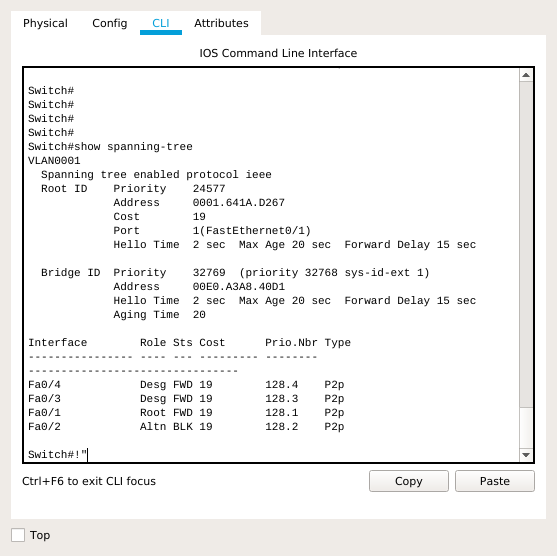

SWX2:\


SWX3:\
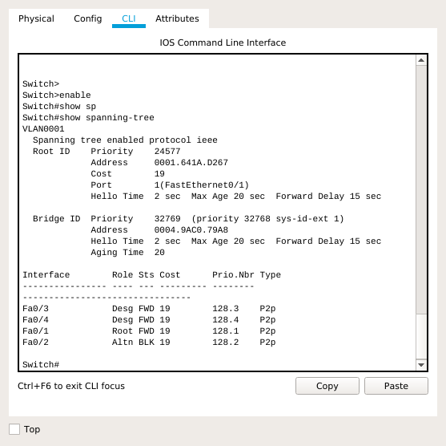

### Q8
Let's take a look at the spannig-route after deleting the routing between SWX1 and SWX2:\
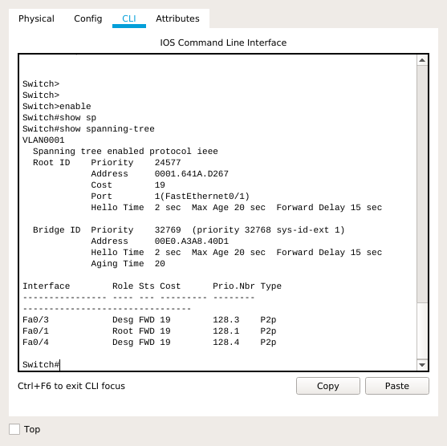

Now we reconnect the cables and disconnect the cable from the root the SWX1:\


Now we ping:\
\
In both cases we can ping the other PC because the switches are going to route the packet over a different path.

### Q9
We cant to configure interfaces as mode trunk links between switches:
```
Switch(config)#interface FastEthernet 0/1
Switch(config-if)#switchport mode trunk
```
To achieve this, apply the command above on every switch on every interface connected to another switch. We can print information about all trunk interfaces using the following command:
```
Switch#show interfaces trunk
```
Which yields the following results:

SWX1:\


SWX2:\
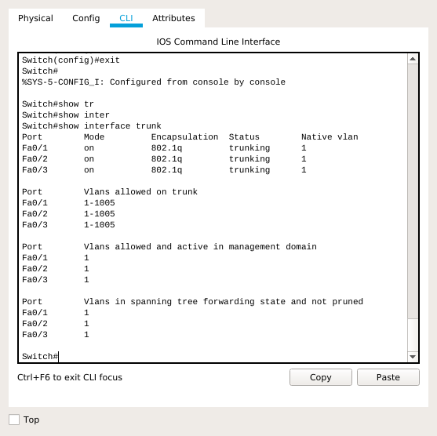

SWX3:\
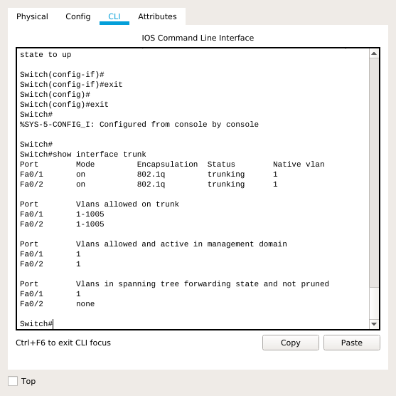

### Q10
Now we want to create VLAN Trunking Protocol for a server and multiple clients. First, we configure the server using the following commands:
```
Switch(config)#vtp domain lab.cisco
Changing VTP domain name from NULL to lab.cisco
Switch(config)#vtp password cisco
Setting device VLAN database password to cisco
Switch(config)#vtp mode server
Device mode already VTP SERVER.
Switch(config)#vtp version 2
```
Second, we configure the clients using the following commands:
```
Switch(config)#vtp domain lab.cisco
Domain name already set to lab.cisco.
Switch(config)#vtp password cisco
Setting device VLAN database password to cisco
Switch(config)#vtp mode client
Setting device to VTP CLIENT mode.
```

### Q11
SWX:\
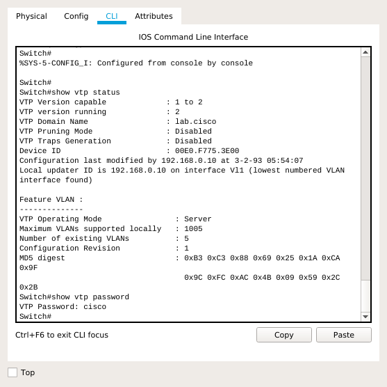

SWX1:\
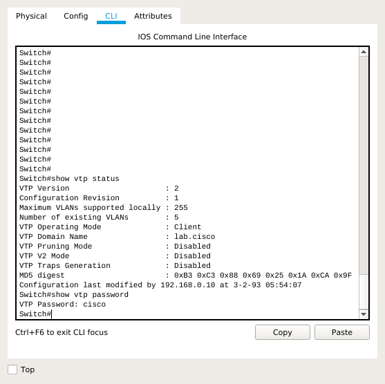

SWX2:\
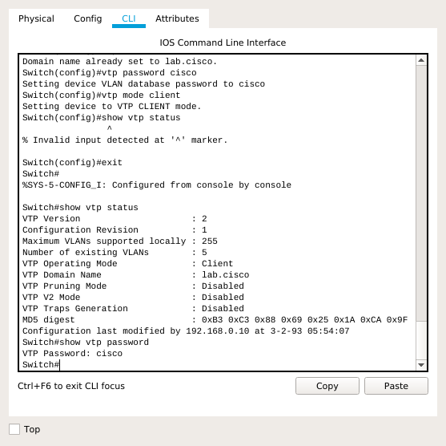

SWX3:\
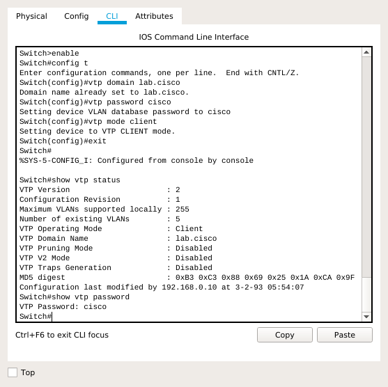

### Q12
We can add VLANs using the following commands:
```
Switch(config)#vlan 10
Switch(config-vlan)#exit
Switch(config)#vlan 20
Switch(config-vlan)#exit
```

### Q13
Now we can print the VLAN configuration.

SWX:\
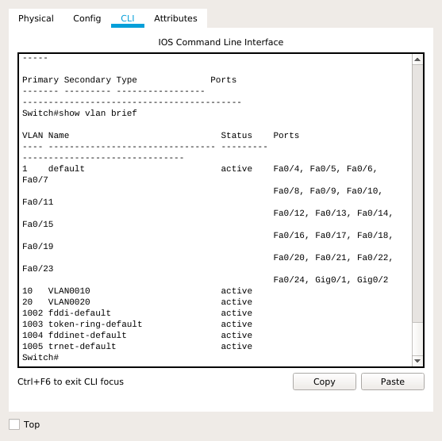

SWX1:\
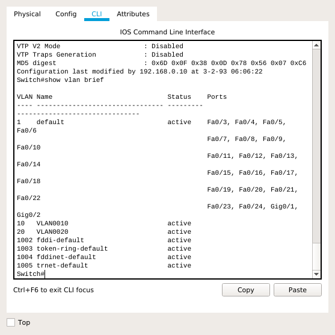

SWX2:\
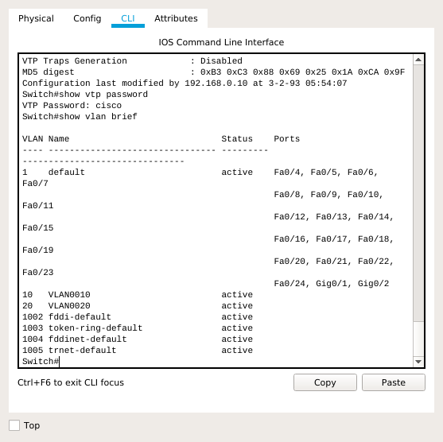

SWX3:\
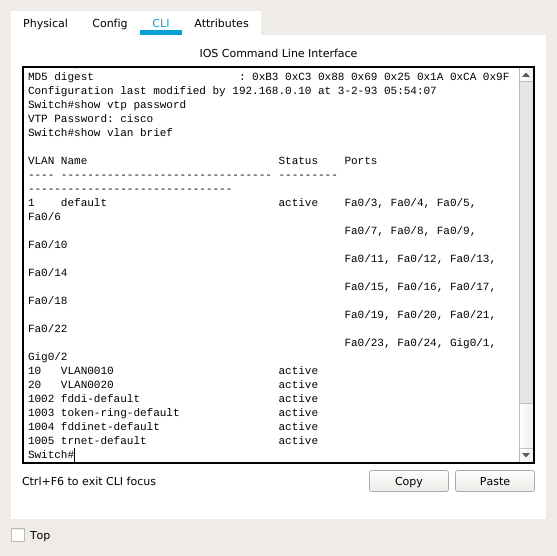

### Q14
SWX1:\
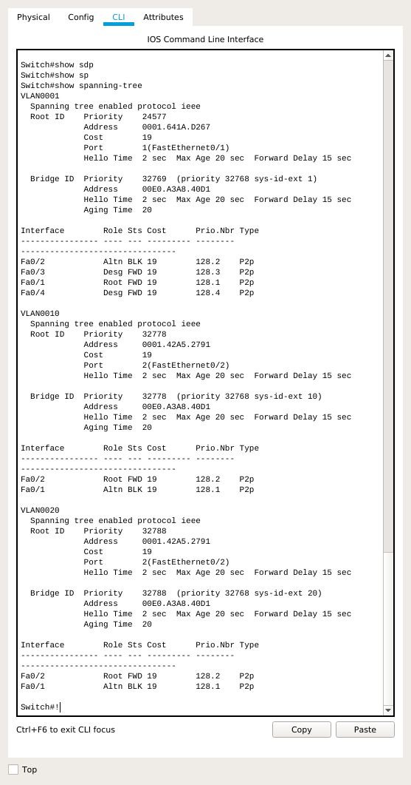

SWX2:\


SWX3:\
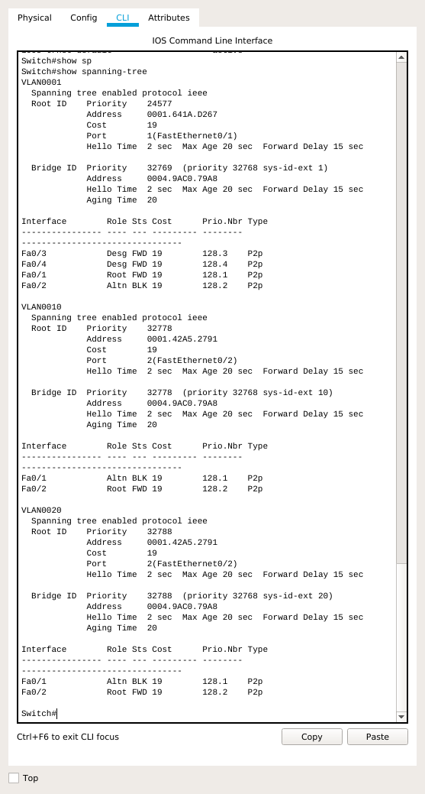

We can observe on all three screenshots that the root bridge for each and every switch is indeed SWX.

### Q15
To change the VLAN on the switch SWX2, we do the following:
```
Switch(config)#interface FastEthernet 0/4
Switch(config-if)#switchport access vlan 10
Switch(config-if)#exit
Switch(config)#interface FastEthernet 0/5
Switch(config-if)#switchport access vlan 20
```
Now PC2-B is on VLAN 10 and PC2-C is on VLAN 20. PC1-A is still on VLAN 1.

### Q16
Now let's try and see how ping works on this new network configuration.

Here is the new network:\
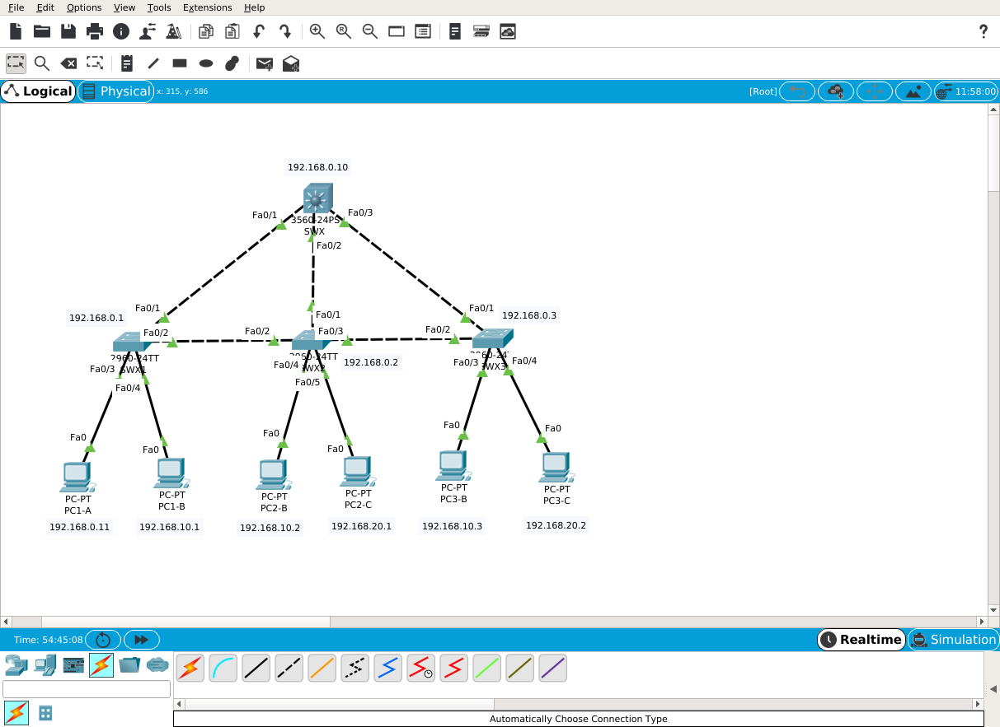

a. Ping PC2-B and PC3-B from PC1-B\
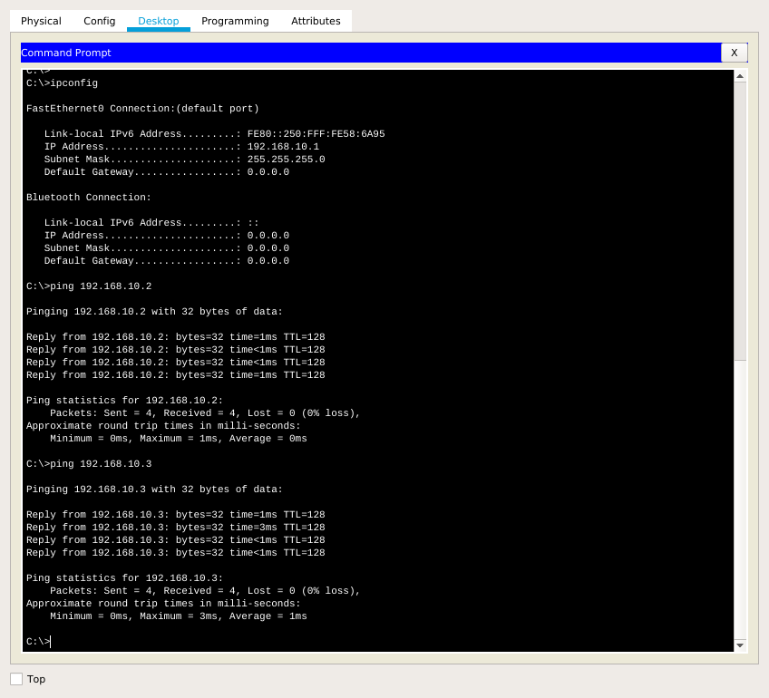

b. Ping PC2-C from PC1-C\
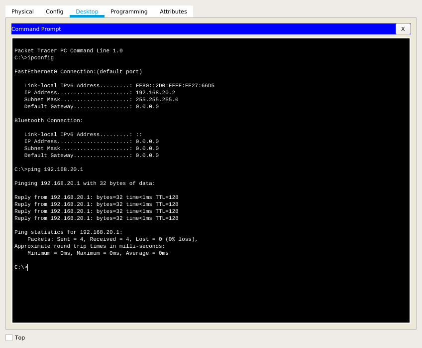

c. Ping PC1-B and PC1-C from PC1-A\
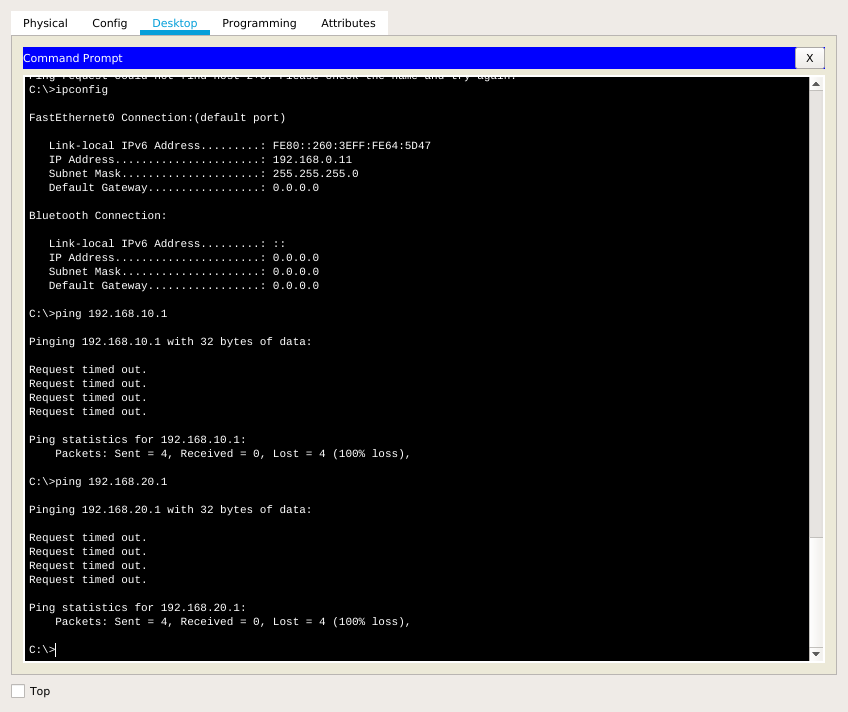\
This ping does not work because we are trying to send an ICMP request to a PC on a network which is different from the one we are currently on. We would need a router to be able to ping other networks.
